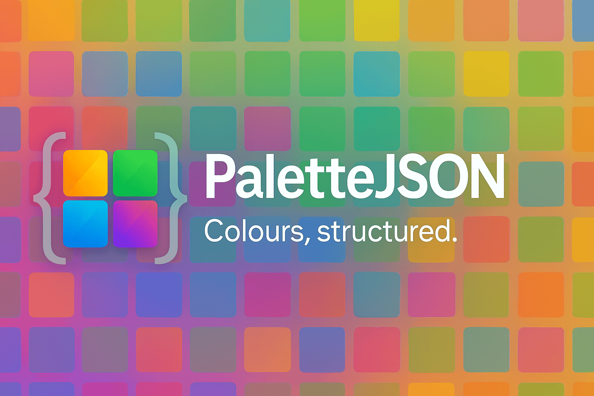

# PaletteJSON



> **⚠️ Early Release**: This is an experimental v0.1 specification. Breaking changes may occur before stabilisation.

**PaletteJSON** is an open JSON schema for defining and sharing colour palettes. It provides a portable container format that supports multiple palettes per file, optional metadata, and accessibility information.

## Why PaletteJSON?

- **Cross‑platform**: Use the same palette definitions in R, Python, JavaScript, BI tools, and more.
- **Multi‑palette bundles**: Store one or many palettes in a single JSON file.
- **Metadata**: Capture author, licence, tags, and provenance alongside colours.
- **Accessibility**: Include palette‑level colour‑vision deficiency (CVD) testing info and per‑colour legibility metrics.
- **Validation**: A published JSON Schema ensures stability and tooling support.

## Status

- Current spec: **v0.1** (draft / experimental).
- Schema file: [`schema/v0.1/palettejson.schema.json`](schema/v0.1/palettejson.schema.json).
- Examples: see [`/examples`](examples).

## Example (minimal)

```json
{
  "palettes": [
    {
      "name": "Example",
      "slug": "example",
      "type": "categorical",
      "colors": [
        { "hex": "#FFFFFF" },
        { "hex": "#000000" },
        { "hex": "#FF0000" },
        { "hex": "#00FF00" },
        { "hex": "#0000FF" }
      ]
    }
  ]
}
```

## Schema Features

- **Palette object**:
  - `name`, `slug`, `type`, `colors[]` required.
  - Optional fields: `description`, `version`, `author`, `license`, `tags`, `colorSpace`, `accessibility`, `aliases`.
- **Colour object**:
  - Requires at least one of:
    - `hex` (always display sRGB, `#RRGGBB` or `#RRGGBBAA`).
    - `components` (numeric array interpreted in the palette’s `colorSpace`).
  - Both may be present. If so, `components` are authoritative and `hex` is a preview / interop value.
  - Supported `colorSpace` values: `sRGB`, `DisplayP3`, `Lab`, `OKLCH`, `sRGB-linear-extended`, `HSL`.
  - Optional fields:
    - `id` (string identifier), `name`, `position`, `notes`.
    - `legibility` (luminance, contrast, preferred text).
    - `references`: array of external identifiers (e.g. Pantone, RAL, NCS).  
      Each entry must declare a `system` and `code`, with optional `library`, `collection`, and `note`.
- **Accessibility block** (palette‑level): tested CVD variants, max distinct classes, notes, tools used.

## File format & identification

- Extension: Files SHOULD use `.palette.json`.
- Encoding: Files MUST be UTF-8.
- Media type:
  - Producers MAY label files as `application/prs.palettejson+json`.
  - Consumers SHOULD also accept `application/json`.
- Apple UTI (optional): `org.palettejson.json`

These identifiers are recommendations for tooling and do not affect schema validity.

## Roadmap

- [ ] v0.1 stabilisation
- [ ] Gradients support
- [ ] Additional colour space definitions
- [ ] Accessibility metadata refinements

For converters, loaders, and utilities, see other repositories in the
[PaletteJSON GitHub organisation](https://github.com/palettejson).

## Documentation

Complete documentation can be found at [palettejson.org](https://palettejson.org).

## Contributing

- Fork the repo, add/update schema or examples.
- Run validation checks before submitting PRs.
- Follow semantic versioning: additive changes only in minor versions.

## License

This project is licensed under the [Apache 2.0 License](LICENSE).
